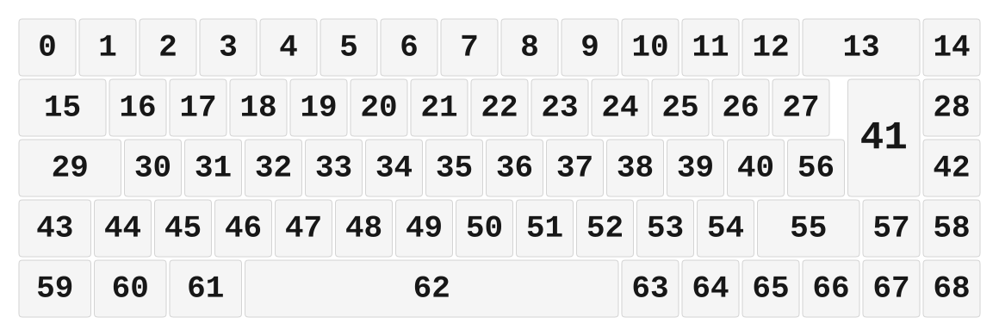

# ZMK Configuration for Links Keyboard

*Generated by Shield Wizard for ZMK*



Download compiled firmware from the Actions tab. <https://zmk.dev/docs/user-setup#installing-the-firmware>

Edit your keymap <https://zmk.dev/docs/keymaps>.
User keymap is located at [`config/links_keyboard.keymap`](config/links_keyboard.keymap).

-----

<details>
<summary>
Shield Wizard Debug Information
</summary>

In case of broken configuration, here is the Shield Wizard internal data used to generate this configuration:

Commit: 5840d41ac0915092c8fe45da617ffb4bb91e1b97

```json
{"name":"Links Keyboard","shield":"links_keyboard","dongle":false,"modules":[],"layout":[{"id":"01KN7GR486ZFSKX0BV511TFA2P","part":0,"row":0,"col":0,"w":1,"h":1,"x":0,"y":0,"r":0,"rx":0,"ry":0},{"id":"01KN7GR486GZVHN8JMGJRBYF04","part":0,"row":0,"col":1,"w":1,"h":1,"x":1,"y":0,"r":0,"rx":0,"ry":0},{"id":"01KN7GR4868B347Y68R6D8QRS3","part":0,"row":0,"col":2,"w":1,"h":1,"x":2,"y":0,"r":0,"rx":0,"ry":0},{"id":"01KN7GR486YB9SEVYF3TKCJXHC","part":0,"row":0,"col":3,"w":1,"h":1,"x":3,"y":0,"r":0,"rx":0,"ry":0},{"id":"01KN7GR486MR62QZCPDCVDFAG3","part":0,"row":0,"col":4,"w":1,"h":1,"x":4,"y":0,"r":0,"rx":0,"ry":0},{"id":"01KN7GR4860CJ1PEZB6WVK744X","part":0,"row":0,"col":5,"w":1,"h":1,"x":5,"y":0,"r":0,"rx":0,"ry":0},{"id":"01KN7GR486M1N7XMW5752FQ53B","part":0,"row":0,"col":6,"w":1,"h":1,"x":6,"y":0,"r":0,"rx":0,"ry":0},{"id":"01KN7GR4868WRBN4KP238WWFHX","part":0,"row":0,"col":7,"w":1,"h":1,"x":7,"y":0,"r":0,"rx":0,"ry":0},{"id":"01KN7GR486BAC0K1ERP8RCB3V0","part":0,"row":0,"col":8,"w":1,"h":1,"x":8,"y":0,"r":0,"rx":0,"ry":0},{"id":"01KN7GR486WC3YRZ0V099N2GQ1","part":0,"row":0,"col":9,"w":1,"h":1,"x":9,"y":0,"r":0,"rx":0,"ry":0},{"id":"01KN7GR486B8B5HFM9RP7RVNYC","part":0,"row":0,"col":10,"w":1,"h":1,"x":10,"y":0,"r":0,"rx":0,"ry":0},{"id":"01KN7GR4860FQ4CF8VR3TV7VA2","part":0,"row":0,"col":11,"w":1,"h":1,"x":11,"y":0,"r":0,"rx":0,"ry":0},{"id":"01KN7GR486F48JJK4TDV2VJTDG","part":0,"row":0,"col":12,"w":1,"h":1,"x":12,"y":0,"r":0,"rx":0,"ry":0},{"id":"01KN7GR486YP7N08V79GS3W479","part":0,"row":0,"col":13,"w":2,"h":1,"x":13,"y":0,"r":0,"rx":0,"ry":0},{"id":"01KN7GR486N17M3DHW4N3QZH6N","part":0,"row":0,"col":15,"w":1,"h":1,"x":15,"y":0,"r":0,"rx":0,"ry":0},{"id":"01KN7GR487MZF2E8M5H6TGFK7W","part":0,"row":1,"col":0,"w":1.5,"h":1,"x":0,"y":1,"r":0,"rx":0,"ry":0},{"id":"01KN7GR487KNCQQGCY9G8F13JC","part":0,"row":1,"col":1,"w":1,"h":1,"x":1.5,"y":1,"r":0,"rx":0,"ry":0},{"id":"01KN7GR487BNVSV37FN1A9RZVX","part":0,"row":1,"col":2,"w":1,"h":1,"x":2.5,"y":1,"r":0,"rx":0,"ry":0},{"id":"01KN7GR487CSW5R19Z69K3KBRQ","part":0,"row":1,"col":3,"w":1,"h":1,"x":3.5,"y":1,"r":0,"rx":0,"ry":0},{"id":"01KN7GR4875M0Q3R4VVGF8Y83V","part":0,"row":1,"col":4,"w":1,"h":1,"x":4.5,"y":1,"r":0,"rx":0,"ry":0},{"id":"01KN7GR487T0SZBEWASDXMY99J","part":0,"row":1,"col":5,"w":1,"h":1,"x":5.5,"y":1,"r":0,"rx":0,"ry":0},{"id":"01KN7GR4875N9C1CK3WFEF1677","part":0,"row":1,"col":6,"w":1,"h":1,"x":6.5,"y":1,"r":0,"rx":0,"ry":0},{"id":"01KN7GR487J7FCBHGY2HYESPS8","part":0,"row":1,"col":7,"w":1,"h":1,"x":7.5,"y":1,"r":0,"rx":0,"ry":0},{"id":"01KN7GR4870KK8TQZ228Q0PT3C","part":0,"row":1,"col":8,"w":1,"h":1,"x":8.5,"y":1,"r":0,"rx":0,"ry":0},{"id":"01KN7GR487TPNASJPC3YPGW37K","part":0,"row":1,"col":9,"w":1,"h":1,"x":9.5,"y":1,"r":0,"rx":0,"ry":0},{"id":"01KN7GR487N3TDB97KKY2MC4G4","part":0,"row":1,"col":10,"w":1,"h":1,"x":10.5,"y":1,"r":0,"rx":0,"ry":0},{"id":"01KN7GR487GGYYEYAKERQEG9WW","part":0,"row":1,"col":11,"w":1,"h":1,"x":11.5,"y":1,"r":0,"rx":0,"ry":0},{"id":"01KN7GR487TTX3M8HXDBER5SDY","part":0,"row":1,"col":12,"w":1,"h":1,"x":12.5,"y":1,"r":0,"rx":0,"ry":0},{"id":"01KN7GR48755NEQVBNW9ADHD6P","part":0,"row":1,"col":14,"w":1,"h":1,"x":15,"y":1,"r":0,"rx":0,"ry":0},{"id":"01KN7GR487VGZ4BH331YTA2X6E","part":0,"row":2,"col":0,"w":1.75,"h":1,"x":0,"y":2,"r":0,"rx":0,"ry":0},{"id":"01KN7GR487VW1953S5R31EDWXY","part":0,"row":2,"col":1,"w":1,"h":1,"x":1.75,"y":2,"r":0,"rx":0,"ry":0},{"id":"01KN7GR487B5ZR4DMVZ8WT0VQ0","part":0,"row":2,"col":2,"w":1,"h":1,"x":2.75,"y":2,"r":0,"rx":0,"ry":0},{"id":"01KN7GR487X7WZ2A9BWR25MT0S","part":0,"row":2,"col":3,"w":1,"h":1,"x":3.75,"y":2,"r":0,"rx":0,"ry":0},{"id":"01KN7GR487ECZTH8BD0CM4AB2E","part":0,"row":2,"col":4,"w":1,"h":1,"x":4.75,"y":2,"r":0,"rx":0,"ry":0},{"id":"01KN7GR4874KTKEWRFDX4A4B5P","part":0,"row":2,"col":5,"w":1,"h":1,"x":5.75,"y":2,"r":0,"rx":0,"ry":0},{"id":"01KN7GR487KN9YF1WX4WP5CYJ3","part":0,"row":2,"col":6,"w":1,"h":1,"x":6.75,"y":2,"r":0,"rx":0,"ry":0},{"id":"01KN7GR487GQJRZ8BNR5BZ7TPC","part":0,"row":2,"col":7,"w":1,"h":1,"x":7.75,"y":2,"r":0,"rx":0,"ry":0},{"id":"01KN7GR487V1KPBMXMSJZSJM56","part":0,"row":2,"col":8,"w":1,"h":1,"x":8.75,"y":2,"r":0,"rx":0,"ry":0},{"id":"01KN7GR487J6FZ9461VYDVQXEK","part":0,"row":2,"col":9,"w":1,"h":1,"x":9.75,"y":2,"r":0,"rx":0,"ry":0},{"id":"01KN7GR4877PF8826QQRB39Q4R","part":0,"row":2,"col":10,"w":1,"h":1,"x":10.75,"y":2,"r":0,"rx":0,"ry":0},{"id":"01KN7GR487DYTCKQQG2GZFMPXD","part":0,"row":2,"col":11,"w":1,"h":1,"x":11.75,"y":2,"r":0,"rx":0,"ry":0},{"id":"01KN7GR487CMAY5WRE8XZVYTAF","part":0,"row":2,"col":12,"w":1.25,"h":2,"x":13.75,"y":1,"r":0,"rx":0,"ry":0},{"id":"01KN7GR487CMQCPJ5CDADFDE7H","part":0,"row":2,"col":13,"w":1,"h":1,"x":15,"y":2,"r":0,"rx":0,"ry":0},{"id":"01KN7GR487YW9XPMDG9SBK3BTP","part":0,"row":3,"col":0,"w":1.25,"h":1,"x":0,"y":3,"r":0,"rx":0,"ry":0},{"id":"01KN7GR4877ZF33FM10VPKVNK2","part":0,"row":3,"col":1,"w":1,"h":1,"x":1.25,"y":3,"r":0,"rx":0,"ry":0},{"id":"01KN7GR487AT7GBS1HNF005NCR","part":0,"row":3,"col":2,"w":1,"h":1,"x":2.25,"y":3,"r":0,"rx":0,"ry":0},{"id":"01KN7GR487ZAPJJ7HY97CM2QZ7","part":0,"row":3,"col":3,"w":1,"h":1,"x":3.25,"y":3,"r":0,"rx":0,"ry":0},{"id":"01KN7GR487PPW7PKDS85Z431Q8","part":0,"row":3,"col":4,"w":1,"h":1,"x":4.25,"y":3,"r":0,"rx":0,"ry":0},{"id":"01KN7GR487HQZ9HJ7HHR2DCH95","part":0,"row":3,"col":5,"w":1,"h":1,"x":5.25,"y":3,"r":0,"rx":0,"ry":0},{"id":"01KN7GR487507WKQ1SNR83F9BB","part":0,"row":3,"col":6,"w":1,"h":1,"x":6.25,"y":3,"r":0,"rx":0,"ry":0},{"id":"01KN7GR487R4W93PYWZCA0CG6C","part":0,"row":3,"col":7,"w":1,"h":1,"x":7.25,"y":3,"r":0,"rx":0,"ry":0},{"id":"01KN7GR487B2R5JEYWPQH08TSM","part":0,"row":3,"col":8,"w":1,"h":1,"x":8.25,"y":3,"r":0,"rx":0,"ry":0},{"id":"01KN7GR487YSZKEGS4JSBD3HG8","part":0,"row":3,"col":9,"w":1,"h":1,"x":9.25,"y":3,"r":0,"rx":0,"ry":0},{"id":"01KN7GR4879P8PYA8CSD7H1WVS","part":0,"row":3,"col":10,"w":1,"h":1,"x":10.25,"y":3,"r":0,"rx":0,"ry":0},{"id":"01KN7GR487TNAMR8D2FEPM5Y29","part":0,"row":3,"col":11,"w":1,"h":1,"x":11.25,"y":3,"r":0,"rx":0,"ry":0},{"id":"01KN7GR487PQ993JNE27D9PQJD","part":0,"row":3,"col":12,"w":1.75,"h":1,"x":12.25,"y":3,"r":0,"rx":0,"ry":0},{"id":"01KN7GR487069EKSHSPFCQNFEY","part":0,"row":3,"col":13,"w":1,"h":1,"x":12.75,"y":2,"r":0,"rx":0,"ry":0},{"id":"01KN7GR487BVT5NPVT6NE24QPT","part":0,"row":3,"col":14,"w":1,"h":1,"x":14,"y":3,"r":0,"rx":0,"ry":0},{"id":"01KN7GR487C0SHMZRRJTWKR5RX","part":0,"row":3,"col":15,"w":1,"h":1,"x":15,"y":3,"r":0,"rx":0,"ry":0},{"id":"01KN7GR487JMGY9BANSNA5X54P","part":0,"row":4,"col":0,"w":1.25,"h":1,"x":0,"y":4,"r":0,"rx":0,"ry":0},{"id":"01KN7GR487HR4A9RR61KWHFZ69","part":0,"row":4,"col":1,"w":1.25,"h":1,"x":1.25,"y":4,"r":0,"rx":0,"ry":0},{"id":"01KN7GR487SQSYKDBC81XPF3WW","part":0,"row":4,"col":2,"w":1.25,"h":1,"x":2.5,"y":4,"r":0,"rx":0,"ry":0},{"id":"01KN7GR487GGK21V29KTMJ3X73","part":0,"row":4,"col":3,"w":6.25,"h":1,"x":3.75,"y":4,"r":0,"rx":0,"ry":0},{"id":"01KN7GR4877HVR53REFDQ380YQ","part":0,"row":4,"col":4,"w":1,"h":1,"x":10,"y":4,"r":0,"rx":0,"ry":0},{"id":"01KN7GR487D5VB0AKNBF9Z9GKM","part":0,"row":4,"col":5,"w":1,"h":1,"x":11,"y":4,"r":0,"rx":0,"ry":0},{"id":"01KN7GR487V9JM40MWYREZFBV0","part":0,"row":4,"col":6,"w":1,"h":1,"x":12,"y":4,"r":0,"rx":0,"ry":0},{"id":"01KN7GR48750BRMRA4JHVEQNX9","part":0,"row":4,"col":7,"w":1,"h":1,"x":13,"y":4,"r":0,"rx":0,"ry":0},{"id":"01KN7GR487F8T4TCJ5EWT0SJKQ","part":0,"row":4,"col":8,"w":1,"h":1,"x":14,"y":4,"r":0,"rx":0,"ry":0},{"id":"01KN7GR487TXGG97AG7H5GPY4J","part":0,"row":4,"col":9,"w":1,"h":1,"x":15,"y":4,"r":0,"rx":0,"ry":0}],"parts":[{"name":"unibody","controller":"nice_nano_v2","wiring":"matrix_diode","pins":{"d0":"input","d2":"input","d3":"input","d5":"input","d6":"input","d21":"input","d20":"input","d19":"input","d18":"input","d15":"input","d14":"input","d16":"input","p101":"output","p102":"output","p107":"output","d8":"output","d9":"output","d1":"input","d7":"input","d4":"input","d10":"input"},"keys":{"01KN7GT09T3Z23MPXNQ14GQDMJ":{"output":"p101"},"01KN7GR486ZFSKX0BV511TFA2P":{"input":"d20","output":"p107"},"01KN7GR486GZVHN8JMGJRBYF04":{"input":"d19","output":"p107"},"01KN7GR4868B347Y68R6D8QRS3":{"input":"d18","output":"p107"},"01KN7GR486YB9SEVYF3TKCJXHC":{"input":"d15","output":"p107"},"01KN7GR486MR62QZCPDCVDFAG3":{"input":"d14","output":"p107"},"01KN7GR486M1N7XMW5752FQ53B":{"input":"d10","output":"p107"},"01KN7GR4868WRBN4KP238WWFHX":{"input":"d1","output":"p107"},"01KN7GR486BAC0K1ERP8RCB3V0":{"input":"d0","output":"p107"},"01KN7GR486B8B5HFM9RP7RVNYC":{"input":"d3","output":"p107"},"01KN7GR4860FQ4CF8VR3TV7VA2":{"input":"d4","output":"p107"},"01KN7GR486F48JJK4TDV2VJTDG":{"input":"d5","output":"p107"},"01KN7GR486YP7N08V79GS3W479":{"input":"d6","output":"p107"},"01KN7GR486N17M3DHW4N3QZH6N":{"input":"d7","output":"p107"},"01KN7GR486WC3YRZ0V099N2GQ1":{"input":"d2","output":"p107"},"01KN7GR487MZF2E8M5H6TGFK7W":{"input":"d20","output":"p102"},"01KN7GR487KNCQQGCY9G8F13JC":{"input":"d19","output":"p102"},"01KN7GR487BNVSV37FN1A9RZVX":{"input":"d18","output":"p102"},"01KN7GR487CSW5R19Z69K3KBRQ":{"input":"d15","output":"p102"},"01KN7GR4875M0Q3R4VVGF8Y83V":{"input":"d14","output":"p102"},"01KN7GR487T0SZBEWASDXMY99J":{"input":"d16","output":"p102"},"01KN7GR4875N9C1CK3WFEF1677":{"input":"d10","output":"p102"},"01KN7GR487J7FCBHGY2HYESPS8":{"input":"d1","output":"p102"},"01KN7GR4870KK8TQZ228Q0PT3C":{"input":"d0","output":"p102"},"01KN7GR487TPNASJPC3YPGW37K":{"input":"d2","output":"p102"},"01KN7GR487N3TDB97KKY2MC4G4":{"input":"d3","output":"p102"},"01KN7GR487GGYYEYAKERQEG9WW":{"input":"d4","output":"p102"},"01KN7GR487TTX3M8HXDBER5SDY":{"input":"d5","output":"p102"},"01KN7GR487CMAY5WRE8XZVYTAF":{"input":"d6","output":"p102"},"01KN7GR48755NEQVBNW9ADHD6P":{"input":"d7","output":"p102"},"01KN7GR487VGZ4BH331YTA2X6E":{"input":"d20","output":"p101"},"01KN7GR487VW1953S5R31EDWXY":{"input":"d19","output":"p101"},"01KN7GR487B5ZR4DMVZ8WT0VQ0":{"input":"d18","output":"p101"},"01KN7GR487X7WZ2A9BWR25MT0S":{"input":"d15","output":"p101"},"01KN7GR487ECZTH8BD0CM4AB2E":{"input":"d14","output":"p101"},"01KN7GR4874KTKEWRFDX4A4B5P":{"input":"d16","output":"p101"},"01KN7GR487KN9YF1WX4WP5CYJ3":{"input":"d10","output":"p101"},"01KN7GR487GQJRZ8BNR5BZ7TPC":{"input":"d1","output":"p101"},"01KN7GR487V1KPBMXMSJZSJM56":{"input":"d0","output":"p101"},"01KN7GR487J6FZ9461VYDVQXEK":{"input":"d2","output":"p101"},"01KN7GR4877PF8826QQRB39Q4R":{"input":"d3","output":"p101"},"01KN7GR487DYTCKQQG2GZFMPXD":{"input":"d4","output":"p101"},"01KN7GR487069EKSHSPFCQNFEY":{"input":"d5","output":"p101"},"01KN7GR487CMQCPJ5CDADFDE7H":{"input":"d7","output":"p101"},"01KN7GR487YW9XPMDG9SBK3BTP":{"input":"d21","output":"d9"},"01KN7GR4877ZF33FM10VPKVNK2":{"input":"d20","output":"d9"},"01KN7GR487AT7GBS1HNF005NCR":{"input":"d19","output":"d9"},"01KN7GR487ZAPJJ7HY97CM2QZ7":{"input":"d18","output":"d9"},"01KN7GR487PPW7PKDS85Z431Q8":{"input":"d15","output":"d9"},"01KN7GR487HQZ9HJ7HHR2DCH95":{"input":"d14","output":"d9"},"01KN7GR487507WKQ1SNR83F9BB":{"input":"d16","output":"d9"},"01KN7GR487R4W93PYWZCA0CG6C":{"input":"d10","output":"d9"},"01KN7GR487B2R5JEYWPQH08TSM":{"input":"d1","output":"d9"},"01KN7GR487YSZKEGS4JSBD3HG8":{"input":"d0","output":"d9"},"01KN7GR4879P8PYA8CSD7H1WVS":{"input":"d2","output":"d9"},"01KN7GR487TNAMR8D2FEPM5Y29":{"input":"d3","output":"d9"},"01KN7GR487PQ993JNE27D9PQJD":{"input":"d5","output":"d9"},"01KN7GR487BVT5NPVT6NE24QPT":{"input":"d6","output":"d9"},"01KN7GR487C0SHMZRRJTWKR5RX":{"input":"d7","output":"d9"},"01KN7GR487JMGY9BANSNA5X54P":{"input":"d21","output":"d8"},"01KN7GR487HR4A9RR61KWHFZ69":{"input":"d20","output":"d8"},"01KN7GR487SQSYKDBC81XPF3WW":{"input":"d19","output":"d8"},"01KN7GR487GGK21V29KTMJ3X73":{"input":"d16","output":"d8"},"01KN7GR4877HVR53REFDQ380YQ":{"input":"d2","output":"d8"},"01KN7GR487D5VB0AKNBF9Z9GKM":{"input":"d3","output":"d8"},"01KN7GR487V9JM40MWYREZFBV0":{"input":"d4","output":"d8"},"01KN7GR48750BRMRA4JHVEQNX9":{"input":"d5","output":"d8"},"01KN7GR487F8T4TCJ5EWT0SJKQ":{"input":"d6","output":"d8"},"01KN7GR487TXGG97AG7H5GPY4J":{"input":"d7","output":"d8"},"01KN7GR4860CJ1PEZB6WVK744X":{"input":"d16","output":"p107"}},"encoders":[],"buses":[{"name":"spi0","devices":[],"type":"spi"},{"name":"spi1","devices":[],"type":"spi"},{"name":"spi2","devices":[],"type":"spi"},{"name":"spi3","devices":[],"type":"spi"},{"name":"i2c0","devices":[],"type":"i2c"},{"name":"i2c1","devices":[],"type":"i2c"}]}]}
```

</details>
